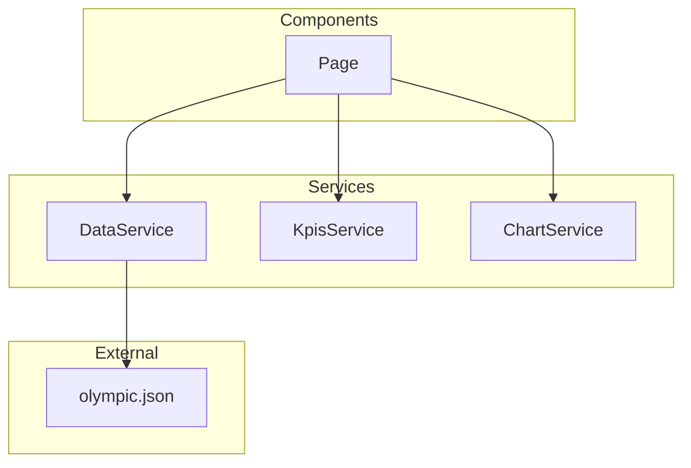

# Architecture

## Arborescence

L'arborescence du projet suit le pattern de séparation des responsabilités :

- `components/` : Composants d'UI réutilisables.
- `services/`: Logiques métier et récupération avec les données.
- `pages/` : Vues principales liées aux routes de l'application.
- `assets/` : Fichiers statiques et données de simulation (mock).

```text
src/
├── app/
│   ├── components/
│   │   ├── back-button/
│   │   ├── card/
│   │   └── chart/
│   │   ├── empty/
│   │   ├── error/
│   │   ├── header/
│   │   ├── loading/
│   ├── models/
│   │   └── olympic.model.ts
│   ├── pages/
│   │   ├── home/
│   │   ├── country/
│   │   └── not-found/
│   └── services/
│       ├── chart.service.ts
│       ├── data.service.ts
│       └── kpis.service.ts
└── assets/
    └── mock/
        └── olympic.json
```

## Composants

Ces composants constituent la bibliothèque d'interface de l'application pour faciliter la maintenabilité des différentes pages. Ils sont conçus pour être autonomes, assurer une cohérence visuelle et une gestion uniforme des états (chargement, erreur, données absentes)

| Composant             | Rôle                                                                     |
| --------------------- | ------------------------------------------------------------------------ |
| `BackButtonComponent` | Permet de revenir à la page d'accueil.                                   |
| `CardComponent`       | Affiche un label et une valeur sous forme de card (Utile pour les KPIs). |
| `ChartComponent`      | Expose un canvas pour générer un Chart à partir d'une config Chart.js.   |
| `EmptyComponent`      | Affiche un message si un élément ne dispose pas de données.              |
| `ErrorComponent`      | Affiche un message d'erreur.                                             |
| `HeaderComponent`     | Affiche le titre de la page, les KPIs et un bouton retour si besoin.     |
| `LoadingComponent`    | Affiche un spinner pour signalier un chargement.                         |

## Services

`DataService` agit comme point d'entrée unique pour l'accès aux données brutes, encapsulant les appels HTTP et le cache derrière des méthodes stables :

- `getOlympics()`: récupère l'ensemble des données `Olympic[]`, triées par nom de pays
- `getCountryById(countryId)`: récupère un pays (`Olympic`) à partir du paramètre `:id` présent dans l'URL,

Cette abstraction permettra de remplacer le fichier JSON mocké (`src/assets/mock/olympic.json`) par un appel HTTP vers une API réelle, sans modifier les composants ni les services spécialisés.

Les composants pages (`HomeComponent`, `CountryComponent`) orchestrent ensuite les données reçues en les transmettant à des services métier dédiés, appelés directement depuis leur `ngOnInit` :

- `KpisService` calcule les indicateurs clés (nombre de pays, médailles, athlètes)
- `ChartService` génère les configurations Chart.js (pie chart ou line chart)



## Models

Les formats de données sont décris via des interface dans `src/app/models/olympic.model.ts` et permettent les traitements liés aux pays, aux participations par pays et au format de KPI.

```ts
export interface Olympic {
  id: number;
  country: string;
  participations: Participation[];
}

export interface Participation {
  id: number;
  year: number;
  city: string;
  medalsCount: number;
  athleteCount: number;
}

export interface Kpi {
  label: string;
  value: number;
}
```

## Routing

Le routing repose sur provideRouter() associé à des composants standalone, remplaçant l'approche classique app-routing.module.ts avec @NgModule (RouterModule.forRoot), désormais considérée comme legacy.

| Route           | Composant           | Rôle                                           |
| --------------- | ------------------- | ---------------------------------------------- |
| `/`             | `HomeComponent`     | Dashboard des participations de tous les pays. |
| `/country/:id`. | `CountryComponent`  | Details statistiques d'un pays.                |
| `/not-found`    | `NotFoundComponent` | Redirection en cas d'erreur de navigation.     |
| `**`            | `NotFoundComponent` | Redirection en cas d'erreur de navigation.     |
