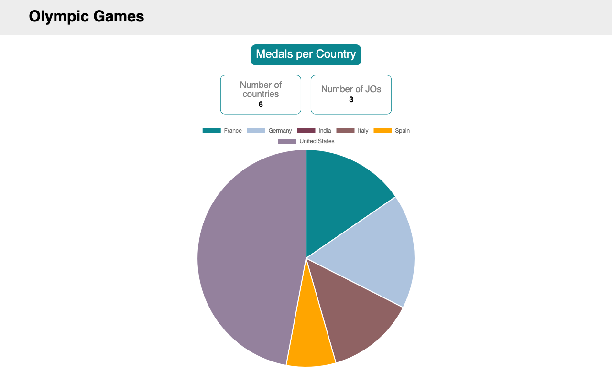
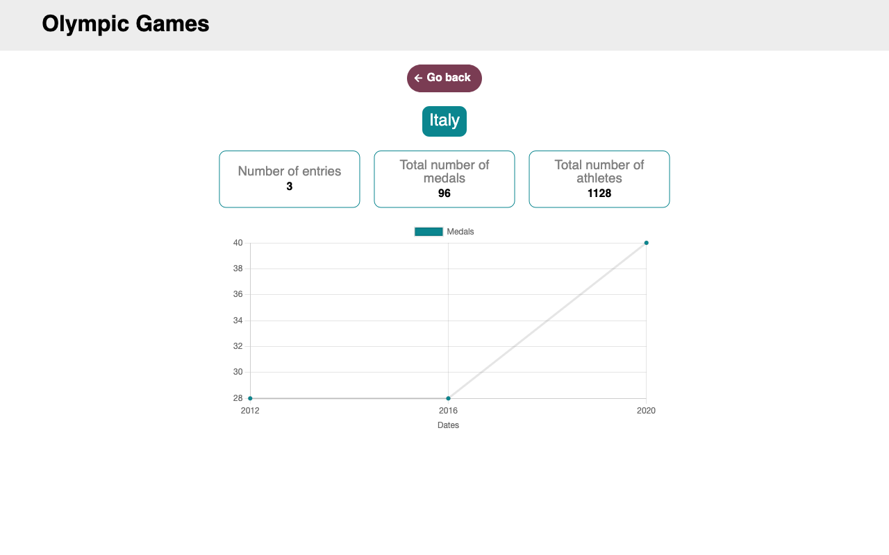
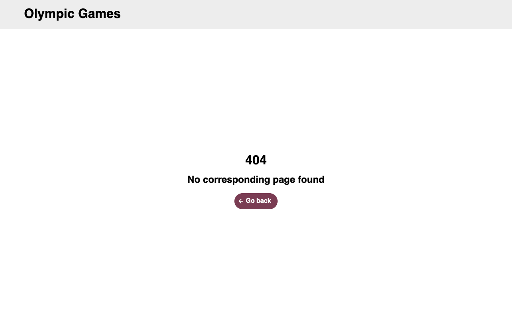

# OlympicGamesStarter

## Table of Contents

- [Presentation](#presentation)
- [Pages](#pages)
- [Project Structure](#project-structure)
- [Prerequisites](#prerequisites)
- [Installation](#installation)
- [Development](#development)
- [Lint](#lint)
- [Build](#build)
- [Screenshots](#screenshots)
- [Technologies Used](#technologies-used)

## Presentation

This project involves refactoring the TéléSport application, which features an "Olympic Games" page displaying interactive charts of historical performance data by country. The goal is to redesign the front-end architecture around three key pillars: enhanced clarity through TypeScript typing, increased modularity via reusable components, and guaranteed scalability by externalizing data management into dedicated services.

## Pages

The application is organized around three main pages, each addressing a distinct functional need:

- Home page: a dashboard displaying the number of Olympic Games held and the number of participating countries, as well as the total medals won by each country, visualized as a pie chart

- Country detail page: accessible by selecting a country, it displays the number of entries, medals won, and athletes involved, along with a chart showing the evolution of medals won by year

- 404 page: handles navigation errors and guides the user in case of an invalid route

## Project Structure

```text
src/
├── app/
│   ├── components/           # Reusable components shared across the application
│   │   ├── back-button/
│   │   ├── card/
│   │   └── chart/
│   │   ├── empty/
│   │   ├── error/
│   │   ├── header/
│   │   ├── loading/
│   ├── models/               # Application data models and type definitions
│   │   └── olympic.model.ts
│   ├── pages/                # Main view components mapped to application routes
│   │   ├── home/
│   │   ├── country/
│   │   └── not-found/
│   └── services/             # Application logic and data retrieval
│       ├── chart.service.ts
│       ├── data.service.ts
│       └── kpis.service.ts
└── assets/
    └── mock/
        └── olympic.json
```

## Prerequisites

- Node.js (LTS version recommended)
- npm
- Angular CLI version 18.0.6

## Installation

1. Clone the repository:
   ```
   git clone https://github.com/bartsam/OC-P2-Angular.git
   ```
2. Move to the repository:
   ```
   cd OC-P2-Angular
   ```
3. Install the dependencies:
   ```
   npm install
   ```
4. Run the local server:
   ```
   ng serve
   ```
5. The app is accessible on `http://localhost:4200/`

## Development

Run `ng serve` for a dev server. Navigate to `http://localhost:4200/`. The application will automatically reload if you change any of the source files.

## Lint

Run `ng lint` to check the code for style and quality issues according to the configured linting rules.

## Build

Run `ng build` to build the project. The build artifacts will be stored in the `dist/` directory.

## Screenshots

| Home Page                          | Country Detail                                  | 404 Page                         |
| ---------------------------------- | ----------------------------------------------- | -------------------------------- |
|  |  |  |

## Technologies Used

- Angular CLI 18.0.6
- TypeScript
- RxJS
- Chart.js
