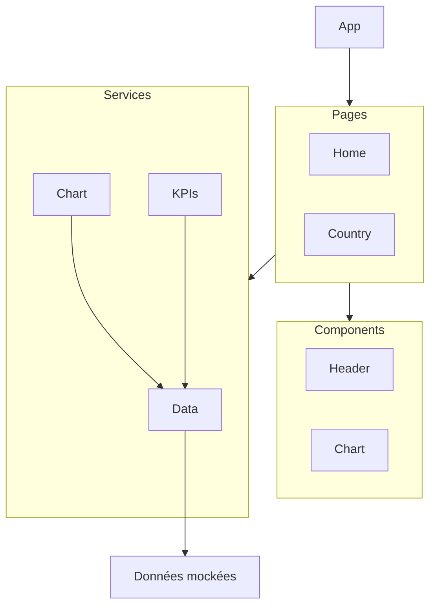

# Notes

## Analyse

- Fichiers trop volumineux : `home.component.ts` et `country.component.ts`
- Code dupliqué :
  - Requêtes HTTP vers `./assets/mock/olympic.json` depuis `home.component.ts` et `country.component.ts` (anti-pattern) à revoir dans un service pour exposer les data
  - Header des pages avec attribut title et "split" elements pour afficher les statistiques
  - Canvas et génération des charts avec `buildPieChart` & `buildChart` a déplacer dans un composant et service dédié
- Code obsolète :
  - Gestion des composants avec `NgModule` à remplacer par standalone components (imports dans le _Decorateur Pattern_ @Component)
  - Gestion du routing avec `NgModule` à remplacer par `provideRouter` dans la config
- Absence de typage strict :
  - Créer un répertoire `/models` pour typer les country et les stats par page
  - Revoir l'initialisation des propriétés avec des types dans les composants pages
  - Remplacer les `any` par les interfaces des models
- Code à supprimer :
  - console.log(`Liste des données : ${JSON.stringify(data)}`); sur home.component.ts
  - Certain calcul de propriété statistique pourrait être simplifié
- Mauvaise gestion des observables :
  - Syntaxe dépréciée du `subscribe` à remplacer par un Observer { next, error } sur les requêtes
  - `pipe()` sur les requête HTTP ne sont pas utilisés
  - Manipulation des données directement dans les composants pages (anti-pattern)
- Autres :
  - Pas de gestion de chargement suite à une requête
  - Pas de gestion d'erreur en cas de donnée manquante par page
  - Pas de gestion d'erreur en cas de mauvais param countryName ou redirection vers not-found

## Architecture

### Objectifs

- une logique de récupération des données dans un service pour centraliser et corriger l'_Observer Pattern_ `this.http.get<any[]>(this.olympicUrl).pipe().subscribe(...)` présent sur toutes les pages :
  - une méthode `getOlympics` pour la page home
  - une méthode `getOlympicbyId` pour la page country
- une logique de préparation des données dans un service pour les KPIs pour les attributs du `header`:
  - une méthode `getOlympicsKPIs` (totalParticipations, totalCountries) pour la page home
  - une méthode `getCountryKPIs` (totalParticipations, totalAthletes et totalMedals) pour la page country
- une logique de préparation des données dans un service pour générer les charts:
  - une méthode `getOlympicsChart` pour la page home
  - une méthode `getCountryChart` pour la page country

```typescript
type Header = {
  title: string;
  kpis: Array<{
    label: string;
    value: number;
  }>;
};

type Chart = {
  config: ChartConfiguration; // type fourni par chart.js
};
```

### Avantages

- Éviter la duplication de la requête vers `olympicUrl` : réduction des appels réseau en stockant les résultats pour éviter les requêtes inutile si les données sont déjà présentes en mémoire.
- Permettra de remplacer l'url de l'API facilement dans le service data.service.ts
- Les composants consomment uniquement les données fournis par les services sans accès à l'API.
- Avoir un code maintenable avec des services dédiés à chaque logique (chart & KPIs)
- Avoir des fichiers plus lisibles et moins volumineux
- Éviter la duplication de logique entre composants ayant une fonctionnalité similaire

### Arborescence

L'arborescence du projet doit suivre le pattern de séparation des responsabilités :

- `components/` : Composants d'UI réutilisables.
- `services/`: Logiques métier et récupération avec les données.
- `pages/` : Vues principales liées aux routes de l'application.
- `assets/` : Fichiers statiques et données de simulation (mock).

```text
src/app/
├── app.component.html
├── app.component.scss
├── app.component.spec.ts
├── app.component.ts
├── app.routes.ts ? app-routing.module.ts
├── app.config.ts ? app.module.ts
├── components/
│ ├── header/
│ ├── card/
│ ├── chart/
│ ├── error/
│ └── loading/
├── models/
│ └── olympic.model.ts
├── pages/
│ ├── country/
│ ├── home/
│ └── not-found/
└── services
  ├── data.service.ts // _Singleton pattern_
  ├── kpis.service.ts
  └── charts.service.ts
```

### Schema


