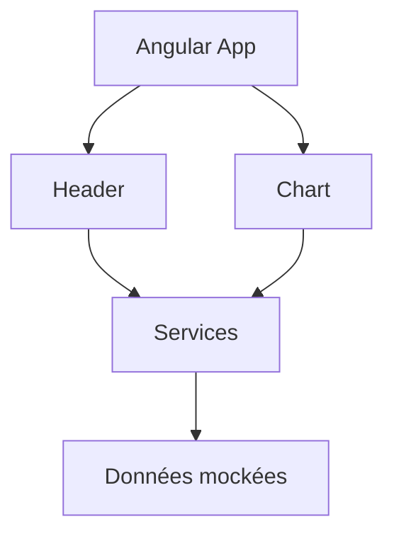

# Notes

## Analyse

- Fichiers trop volumineux : home.component.ts et country.component.ts
- Code dupliqué :
  - Requêtes de './assets/mock/olympic.json'
  - Header des pages (avec attribut title)
  - Composant Chart avec gestion de deux type (interface ChartType) et buildPieChart & buildChart a déplacer dans un service dédié aux Charts
  - Composant ".split" pour afficher les statistiques par page (dans header ?)
- Code obsolète :
  - Remplacer NgModule par les imports dans le décorateur @Component
  - Importer RouterOutlet plutot que NgModule dans app.component.ts
  - Observable `subscribe` dépriécié à revoir avec Observer Pattern
- Appels HTTP dans les composants à revoir dans un service pour exposer les data (/assets/mock) : home.component.ts et country.component.ts (anti-pattern)
- Absence de typage strict :
  - Créer un répertoire /models pour typer les country et les stats par page
  - Revoir l'initialisation des attributs dans ngOnInit
  - Il manque les types des lib de test (jasmine)
- Code à supprimer :
  - console.log(`Liste des données : ${JSON.stringify(data)}`); sur home.component.ts
- Mauvaise gestion des observables : `subscribe` dépriécié à revoir avec Observer Pattern et rxjs ?
- Autres :
  - Initialisation des attributs et manipulation des données directement dans les composants (anti-pattern)
  - Remplacer la navigation du chart par navigateByUrl
  - NotFoundComponent pourrait avoir l'attribut Router dans le constructor
  - Pas de gestion d'erreur en cas de donnée manquante par page
  - Pas de gestion d'erreur en cas de mauvais param countryName ou redirection vers not-found

## Architecture

### Objectifs

- une logique de récupération des countries dans un service pour la page dashboard/home:
  - une méthode `getOlympicsKPIs` (totalParticipations, totalCountries) pour initialiser les attributs du `header`
  - une méthode `getOlympicsChart` pour initialiser les attributs du composant `chart` ({type:"pie", labels:Array<country>, values: Array<SumOfMedalsCount>})
- une logique de récupération d'un country par id pour la page country:
  - une méthode `getCountryKPIs` (totalParticipations, totalAthletes et totalMedals) pour les attributs du `header`
  - une méthode `getCountryChart` pour initialiser les attributs du composant `chart` ({type:"bar", labels:Array<participations.year>, values:Array<participations.medalsCount>})

````typescript
type Header = {
  title: string,
  kpis: Array<{
    label:string,
    value:number
  }>
}

type Chart = {
  type: 'pie' | 'bar',
  labels: Array<string>,
  values: Array<number | string>,
}
```
### Avantages

- Éviter la duplication de la requête vers `olympicUrl`
- Permettra de remplacer l'url de l'API facilement dans le service data.service.ts
- Avoir un code maintenable avec des services dédiés à chaque logique (chart & header)
- Avoir des fichicers lisible moins long
- Éviter la duplication d'UI avec des composants par fonctionnalités

### Arborescence

```text
src/app/
├── app.component.html
├── app.component.scss
├── app.component.spec.ts
├── app.component.ts
├── ?? app.routes.ts | app-routing.module.ts
├── ?? app.config.ts | app.module.ts
├── components/
│ ├── header
│ │ ├── header.component.html
│ │ ├── header.component.scss
│ │ ├── header.component.spec.ts
│ │ └── header.component.ts
│ └── chart
│ │ ├── chart.component.html
│ │ ├── chart.component.scss
│ │ ├── chart.component.spec.ts
│ │ └── chart.component.ts
├── models/
│ ├── country.model.ts
│ ├── stats.model.ts
│ ├── chart.model.ts
│ └── chart.type.ts
├── pages/
│ ├── country
│ │ ├── country.component.html
│ │ ├── country.component.scss
│ │ ├── country.component.spec.ts
│ │ └── country.component.ts
│ ├── home
│ │ ├── home.component.html
│ │ ├── home.component.scss
│ │ ├── home.component.spec.ts
│ │ └── home.component.ts
│ └── not-found
│   ├── not-found.component.html
│   ├── not-found.component.scss
│   ├── not-found.component.spec.ts
│   └── not-found.component.ts
└── services
  ├── data.service.ts // Singleton pattern
  ├── stats.service.ts // Adapter pattern
  └── charts.service.ts // Adapter pattern
```


````
